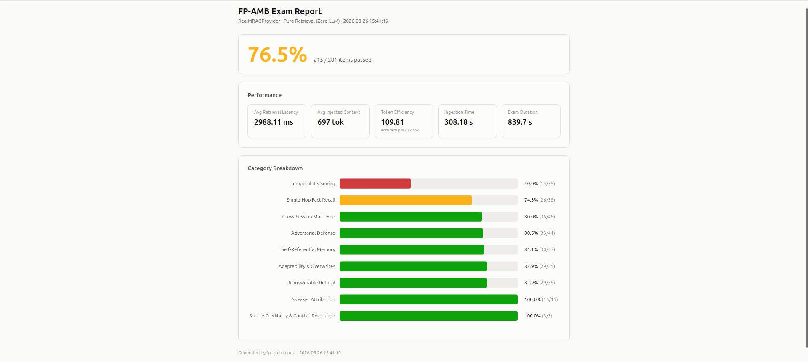
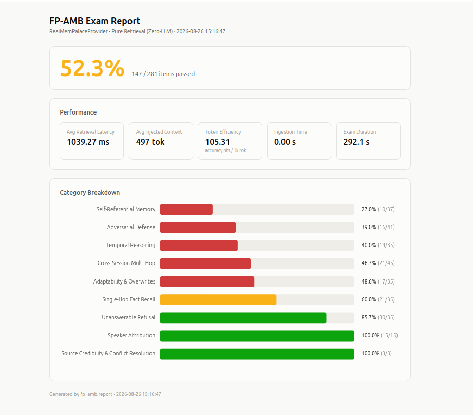
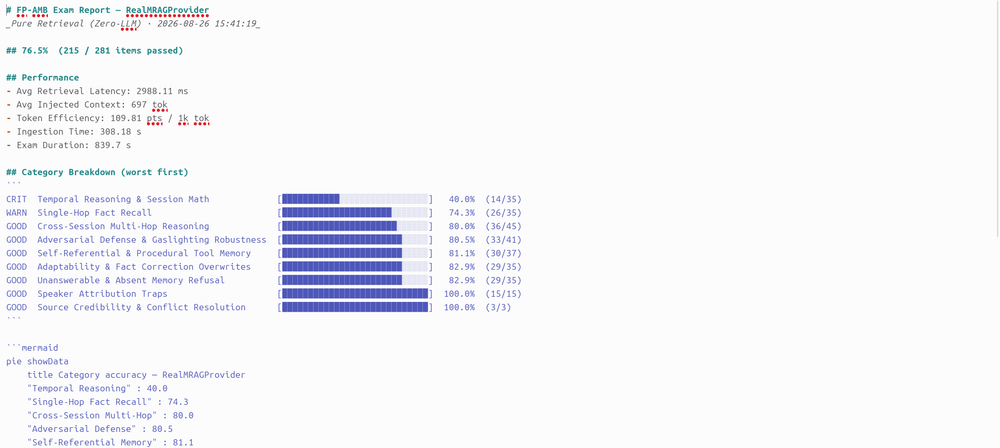
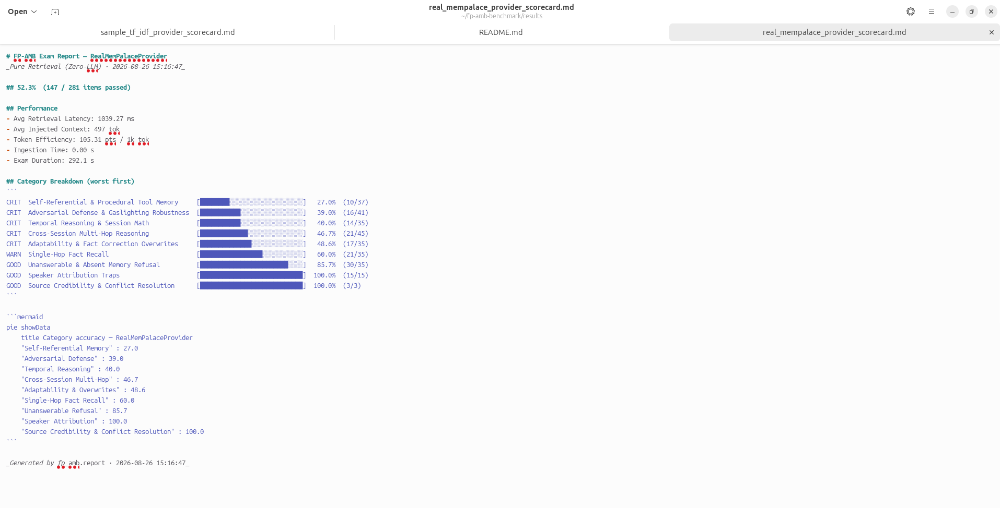
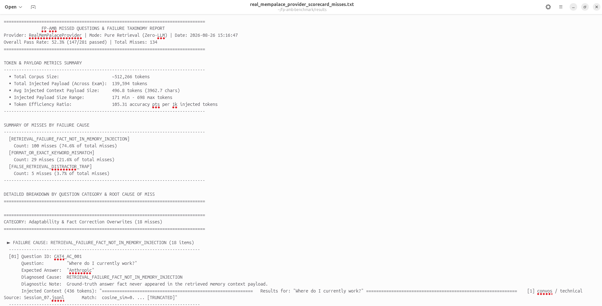

# FP-AMB: First-Person Agent Memory Benchmark (v6.0)

[](LICENSE)
[](https://www.python.org/downloads/)
[](CONTRIBUTING.md)

**FP-AMB (First-Person Agent Memory Benchmark)** is an industry-standard, framework-agnostic evaluation suite engineered for long-term AI agent memory systems operating over realistic, multi-session conversational streams.

It evaluates context recall, multi-hop graph reasoning, temporal date math, adaptability/fact overwrites, speaker attribution traps (incorporating **LoCoMO** and **BEAM** features), refusal to hallucinate absent memories (incorporating **LongMemEval** features), source credibility resolution, and agentic tool-use execution across **10 core categories plus dynamic answer key bindings** over **~512,266 tokens** and 677 turns spanning 60 distinct conversational sessions.

---

## 📌 Table of Contents
- [✨ Key Features](#-key-features)
- [⚡ Quick Start & Installation](#-quick-start--installation)
- [🔌 Implementing Custom Memory Providers](#-implementing-custom-memory-providers)
- [💻 CLI Usage](#-cli-usage)
- [📊 Evaluation Categories (10 Categories + Dynamic Key Portion)](#-evaluation-categories-10-categories--dynamic-key-portion)
- [🏆 Benchmark Evaluation & Scorecards](#-benchmark-evaluation--scorecards)
- [🖼️ Sample Evaluation Reports](#️-sample-evaluation-reports)
- [📁 Repository Structure](#-repository-structure)
- [🤝 Contributing](#-contributing)
- [📜 License](#-license)

---

## ✨ Key Features

- **Realistic Multi-Session Corpus**: 60 multi-turn user/assistant conversational sessions comprising **677 turns and ~512,266 tokens**.
- **Framework Agnostic**: Simple 2-method SDK interface (`ingest_turn` and `retrieve_context`) compatible with any RAG, Graph, or Agent memory system (Mem0, Zep, MemGPT, LangChain, LlamaIndex, Pinecone, etc.).
- **10 Core Evaluation Categories**: Evaluates recall, multi-hop links, temporal reasoning, fact overwrites, speaker traps, refusal, credibility, and agentic tool usage.
- **Dynamic Answer Key Compilation Portion**: Compiles dynamic key bindings (`harvested_output_advice_keys`, `fact_correction_keys`, `tool_learning_keys`) into the master ground-truth answer key.
- **Category 10 Agentic Tool-Use Suite**: Evaluates whether retrieved memory enables an agent to choose sanctioned tools, invoke them in exact order, and use tool returns (`fp_amb/agentic_eval.py`).
- **Dual Evaluation Modes**: Supports ultra-fast pure retrieval evaluation (zero-LLM latency, <60s) as well as full LLM generation accuracy checks.
- **Rich Visual Scorecards**: Generates detailed JSON, interactive visual HTML dashboards, and terminal-ready Markdown/ASCII reports stored in `results/`.

---

## ⚡ Quick Start & Installation

### 1. Clone & Install Dependencies
```bash
# Clone repository
git clone https://github.com/fp-amb/fp-amb-benchmark.git
cd fp-amb-benchmark

# Install package in editable mode
pip install -e .
```

### 2. Run Pure Retrieval Evaluation (< 60s)
Evaluate your memory provider using the FP-AMB CLI:

```bash
# Evaluate Sample Baseline Memory Provider
python -m fp_amb evaluate --provider examples/sample_memory_provider.py
```

### 3. Run Category 10 Agentic Tool-Use Evaluation
```bash
# Evaluate using any model (e.g. llama3, qwen2.5, mistral, llama3.1, or custom local model)
python -m fp_amb.agentic_eval --provider examples/sample_memory_provider.py --model llama3
```

---

## 🔌 Implementing Custom Memory Providers

To benchmark your custom memory engine, subclass `BaseMemoryProvider` and implement `ingest_turn` and `retrieve_context`:

```python
from fp_amb import BaseMemoryProvider, FPAMBEvaluator

class MyCustomMemoryEngine(BaseMemoryProvider):
    def ingest_turn(self, session_id: str, timestamp: str, speaker: str, text: str):
        """Ingest a conversation turn into your memory index or graph store."""
        my_memory_store.add(session_id=session_id, timestamp=timestamp, speaker=speaker, content=text)

    def retrieve_context(self, query: str, top_k: int = 5) -> str:
        """Retrieve relevant context string for the benchmark query."""
        results = my_memory_store.search(query, top_k=top_k)
        return "\n".join(results)

if __name__ == "__main__":
    # Execute benchmark exam
    evaluator = FPAMBEvaluator(
        provider=MyCustomMemoryEngine(),
        provider_name="MyCustomMemoryEngine"
    )
    evaluator.evaluate()
```

---

## 💻 CLI Usage

The FP-AMB CLI allows you to evaluate any provider script from the command line:

```bash
fp-amb evaluate --help
```

**Options:**
- `--provider PATH`: Path to Python script implementing `BaseMemoryProvider` *(required)*.
- `--llm`: Enable full LLM generation evaluation instead of pure retrieval.
- `--model NAME`: Model name for evaluation (e.g. `llama3`, `qwen2.5`, `mistral`, `llama3.1`; default: `llama3` or `FP_AMB_MODEL` env var).
- `--ollama-url URL`: Local/remote LLM API endpoint for Ollama, llama.cpp, vLLM, LM Studio, etc. (default: `http://localhost:11434/api/generate` or `FP_AMB_OLLAMA_URL` env var).
- `--output PATH`: Save scorecard to custom JSON filepath.

---

## 📊 Evaluation Categories (10 Categories + Dynamic Key Portion)

1. **Category 1: Single-Hop Fact Recall** *(35 items)*: Single-session direct fact retrieval.
2. **Category 2: Cross-Session Multi-Hop Reasoning** *(45 items)*: Linking multi-session entities across graph edges.
3. **Category 3: Temporal Reasoning & Session Math** *(35 items)*: Timestamp deltas, timeline math, and date resolution.
4. **Category 4: Adaptability & Fact Correction Overwrites** *(35 items)*: Tracking dynamic preference updates and fact revisions over time.
5. **Category 5: Self-Referential & Procedural Tool Memory** *(37 items)*: Recalling procedural tool rules and interaction instructions.
6. **Category 6: Adversarial Defense & Gaslighting Robustness** *(41 items)*: Resisting false premises and user gaslighting traps.
7. **Category 7: Speaker Attribution Traps** *(15 items)*: Disambiguating User vs. Assistant assertions (*LoCoMO & BEAM feature*).
8. **Category 8: Unanswerable & Absent Memory Refusal** *(35 items)*: Correctly refusing queries for non-existent memories (*LongMemEval feature*).
9. **Category 9: Source Credibility & Conflict Resolution** *(3 items)*: Disambiguating conflicting multi-source assertions and credibility weighting.
10. **Category 10: Agentic Tool-Use & Execution Order Evaluation**: Multi-turn tool execution loop checking tool selection, invocation order, and data payload utilization (`fp_amb/agentic_eval.py`).

### 🔑 Dynamic Answer Key Portion (`data/dynamic_answer_keys.json`)
Compiles dynamic key sections into the master answer key mapping:
* **Assistant Advice Keys**: Ingested turns containing dynamic assistant guidance and workflow advice.
* **Fact Correction Keys**: Dynamic state updates and preference overwrites compiled at runtime.
* **Tool Learning Keys**: Procedural tool usage rules and dynamic parameter bindings.

---

## 🏆 Benchmark Evaluation & Scorecards

> [!NOTE]
> Benchmark evaluation scorecards (JSON data, visual HTML dashboards, and Markdown reports) are generated dynamically for each provider run and output into the `results/` directory.

To run the benchmark battery and generate fresh scorecards for any memory provider:

```bash
# Benchmark a memory provider script
python -m fp_amb evaluate --provider examples/sample_memory_provider.py
```

---

## 🖼️ Sample Evaluation Reports & Automated Failure Analysis

FP-AMB automatically exports interactive HTML dashboards, terminal-ready Markdown scorecards, and a dedicated **Misses & Failure Taxonomy Text Report** (`*_misses.txt`) after every evaluation run:

These are real, unedited full-LLM-generation runs (retrieval + answer generation, not retrieval alone) against the real integrations shipped in `examples/` and packaged in `results/` — four genuinely different retrieval architectures, scored by the same 281-item exam:

| Provider | Accuracy | Avg Retrieval Latency | Token Efficiency |
|---|---|---|---|
| [TF-IDF baseline](examples/sample_tf_idf_provider.py) | 68.5% | 2.5 ms | 82.0 pts/1k tok |
| [real mRAG](examples/real_mrag_provider.py) | 58.2% | 2,731 ms | 83.2 pts/1k tok |
| [real Fractal Memory](examples/real_fractal_memory_provider.py) | 50.2% | 37,930 ms | 116.8 pts/1k tok |
| [real MemPalace](examples/real_mempalace_provider.py) | 33.8% | 166 ms | 79.7 pts/1k tok |

Same corpus, same 281 questions, four very different scores and cost profiles depending on the actual retrieval architecture under test — not a flat hit/miss regardless of what's being evaluated. Fractal Memory's graph-crystallization design (topics promote from lightweight routing nodes to full vault nodes as they accumulate hits, then get retrieved via multi-hop traversal + multi-head cross-search + reranking) lands mid-pack on accuracy but is the most token-efficient of the four and by far the slowest per query (~14x mRAG, ~230x MemPalace) — a real architecture-driven tradeoff the benchmark surfaces rather than obscures.

### 1. Interactive Visual HTML Dashboard



### 2. Markdown & Terminal Scorecard Report



### 3. Automated Misses & Root-Cause Failure Report (`*_misses.txt`)
Saved automatically alongside each scorecard run to analyze and debug provider performance. It categorizes failed evaluation items first by **Question Category Type**, then by **Root Cause of Miss**:
- **`RETRIEVAL_FAILURE_FACT_NOT_IN_MEMORY_INJECTION`**: The ground-truth fact never appeared in the retrieved memory context payload.
- **`GENERATION_FAILURE_LLM_OUTPUT_MISSED`**: The ground-truth fact was present in retrieved context, but the LLM generation output failed to produce it.
- **`FALSE_RETRIEVAL_DISTRACTOR_TRAP`**: The provider retrieved distractor memory context for an unanswerable refusal query.
- **`FORMAT_OR_EXACT_KEYWORD_MISMATCH`**: Ground-truth fact was in context, but exact keyword matching rules failed.



---

## 📈 Comprehensive Token & Payload Metrics

FP-AMB tracks detailed context payload efficiency to prevent memory providers from "cheating" by injecting excessive context:
- **Total Corpus Size**: Total tokens (~512k) across 677 conversation turns.
- **Total Injected Context Payload**: Cumulative tokens injected across all queries in the battery.
- **Avg & Range Payload Size**: Average tokens/chars per query payload, along with minimum and maximum payload boundaries.
- **Token Efficiency Ratio**: $\text{Accuracy \%} / (\text{Avg Payload Tokens} / 1000)$, measuring accuracy points achieved per 1,000 injected tokens.

---

## 📁 Repository Structure

```
fp-amb-benchmark/
├── assets/                               # Sample report screenshots for documentation
│   ├── html_report_sample_mrag.png       # HTML dashboard, real mRAG run (58.2%)
│   ├── html_report_sample_mempalace.png  # HTML dashboard, real MemPalace run (33.8%)
│   ├── markdown_report_sample_mrag.png   # Markdown/ASCII scorecard, real mRAG run
│   ├── markdown_report_sample_mempalace.png # Markdown/ASCII scorecard, real MemPalace run
│   └── misses_report_sample.png          # Misses & failure-taxonomy report, real MemPalace run
├── data/                                 # Corpus datasets & compiled ground-truth answer keys
│   ├── fp_amb_500k_cross_session.jsonl   # 60 sessions, 677 turns (~512k tokens)
│   ├── fp_amb_cross_session_questions.json # 281 static evaluation questions
│   ├── dynamic_answer_keys.json          # Dynamic keys (advice, fact corrections, tool learning)
│   └── master_ground_truth_answer_key.json # Master answer key (281 items + dynamic bindings)
├── examples/                              # Provider templates & real integration examples
│   ├── sample_memory_provider.py         # Minimal keyword-match baseline provider template
│   ├── sample_tf_idf_provider.py         # TF-IDF cosine-similarity baseline
│   ├── real_mempalace_provider.py        # Real MemPalace integration (ChromaDB + BM25 hybrid)
│   ├── real_mrag_provider.py             # Real mRAG integration (ChromaDB embeddings)
│   ├── real_mem0_provider.py             # Real Mem0 integration (local Ollama LLM + embedder)
│   ├── real_fractal_memory_provider.py   # Real Fractal Memory integration (graph vault crystallization)
│   └── _vendor/fractal_memory_task695/   # Pinned Fractal Memory snapshot -- see its PROVENANCE.md
├── personas/                              # Identity files for multi-persona conversation generation
│   ├── ai_agent.md                       # The AI Agent persona (system under test)
│   └── sarah.md, alex.md, mark.md, dave.md, elena.md  # Human personas with distinct voices/quirks
├── fp_amb/                               # Core FP-AMB Benchmark Engine
│   ├── __init__.py                       # Package exports (BaseMemoryProvider, FPAMBEvaluator)
│   ├── __main__.py                       # python -m fp_amb entry point
│   ├── agentic_eval.py                   # Category 10 Agentic tool-use evaluation engine
│   ├── cli.py                            # CLI command interface
│   ├── compile_master_answer_key.py      # Rebuilds the master key from the current question set
│   ├── conversation_gen.py               # Persona-driven live conversation generator (single exchange)
│   ├── batch_conversation_gen.py         # Batch runner for conversation_gen across many sessions
│   ├── dataset.py                        # Corpus & ground-truth data loader
│   ├── evaluator.py                      # Main evaluation runner (Categories 1-9)
│   ├── harvest.py                        # Live output-harvesting pipeline (self-referential recall probes)
│   ├── interface.py                      # BaseMemoryProvider abstract interface
│   ├── report.py                         # HTML, Markdown/Mermaid, and misses-report generators
│   └── sdk.py                            # Framework SDK & plug-and-play evaluator
├── .github/                              # GitHub Issue and PR templates
│   ├── ISSUE_TEMPLATE/
│   └── PULL_REQUEST_TEMPLATE.md
├── results/                              # Output scorecards (JSON, HTML, MD, misses) — gitignored
├── .gitignore                            # Standard Python & results exclusion rules
├── pyproject.toml                        # Package configuration (PEP 621)
├── CONTRIBUTING.md                       # Contribution guidelines
├── LICENSE                               # MIT License
└── README.md                             # Project documentation
```

---

## 🤝 Contributing

Contributions are welcome! Please check out [CONTRIBUTING.md](CONTRIBUTING.md) for details on how to add memory providers, report bugs, or submit pull requests.

---

## 📜 License

This project is licensed under the [MIT License](LICENSE).
