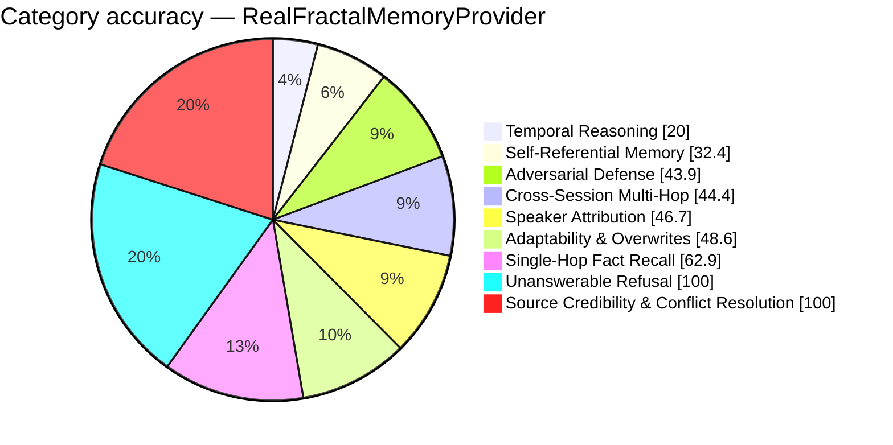

# FP-AMB Exam Report — RealFractalMemoryProvider
_Full LLM Generation — gemini-2.5-flash · 2026-08-27 07:09:59_

## 50.2%  (141 / 281 items passed)

## Performance
- Avg Retrieval Latency: 37930.10 ms
- Avg Injected Context: 430 tok
- Token Efficiency: 116.81 pts / 1k tok
- Ingestion Time: 1245.26 s
- Exam Duration: 11435.7 s

## Category Breakdown (worst first)
```
CRIT  Temporal Reasoning & Session Math             [██████░░░░░░░░░░░░░░░░░░░░░░]   20.0%  (7/35)
CRIT  Self-Referential & Procedural Tool Memory     [█████████░░░░░░░░░░░░░░░░░░░]   32.4%  (12/37)
CRIT  Adversarial Defense & Gaslighting Robustness  [████████████░░░░░░░░░░░░░░░░]   43.9%  (18/41)
CRIT  Cross-Session Multi-Hop Reasoning             [████████████░░░░░░░░░░░░░░░░]   44.4%  (20/45)
CRIT  Speaker Attribution Traps                     [█████████████░░░░░░░░░░░░░░░]   46.7%  (7/15)
CRIT  Adaptability & Fact Correction Overwrites     [██████████████░░░░░░░░░░░░░░]   48.6%  (17/35)
WARN  Single-Hop Fact Recall                        [██████████████████░░░░░░░░░░]   62.9%  (22/35)
GOOD  Unanswerable & Absent Memory Refusal          [████████████████████████████]  100.0%  (35/35)
GOOD  Source Credibility & Conflict Resolution      [████████████████████████████]  100.0%  (3/3)
```



_Generated by fp_amb.report · 2026-08-27 07:09:59_