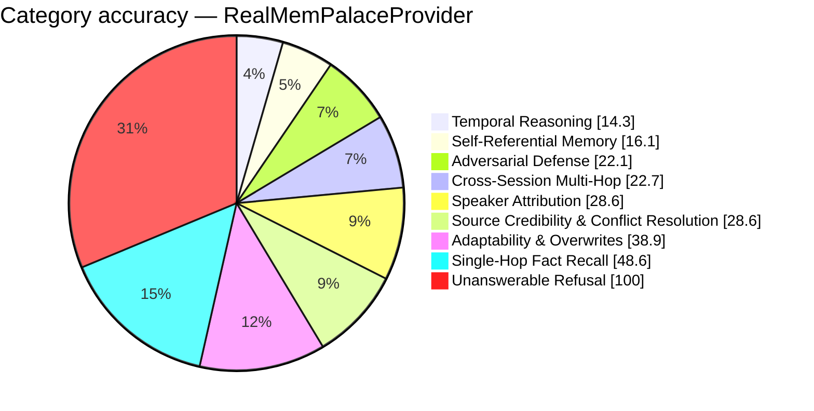

# FP-AMB Exam Report — RealMemPalaceProvider
_Full LLM Generation — gemini-2.5-flash · 2026-08-27 19:44:38_

## 36.1%  (94.5 / 262 items passed)

## Performance
- Avg Retrieval Latency: 178.37 ms
- Avg Injected Context: 426 tok
- Token Efficiency: 84.66 pts / 1k tok
- Ingestion Time: 0.00 s
- Exam Duration: 667.0 s

## Category Breakdown (worst first)
```
CRIT  Temporal Reasoning & Session Math             [████░░░░░░░░░░░░░░░░░░░░░░░░]   14.3%  (5/35)
CRIT  Self-Referential & Procedural Tool Memory     [█████░░░░░░░░░░░░░░░░░░░░░░░]   16.1%  (5/31)
CRIT  Adversarial Defense & Gaslighting Robustness  [██████░░░░░░░░░░░░░░░░░░░░░░]   22.1%  (9.5/43)
CRIT  Cross-Session Multi-Hop Reasoning             [██████░░░░░░░░░░░░░░░░░░░░░░]   22.7%  (10/44)
CRIT  Speaker Attribution Traps                     [████████░░░░░░░░░░░░░░░░░░░░]   28.6%  (4/14)
CRIT  Source Credibility & Conflict Resolution      [████████░░░░░░░░░░░░░░░░░░░░]   28.6%  (2/7)
CRIT  Adaptability & Fact Correction Overwrites     [███████████░░░░░░░░░░░░░░░░░]   38.9%  (7/18)
CRIT  Single-Hop Fact Recall                        [██████████████░░░░░░░░░░░░░░]   48.6%  (17/35)
GOOD  Unanswerable & Absent Memory Refusal          [████████████████████████████]  100.0%  (35/35)
```



_Generated by fp_amb.report · 2026-08-27 19:44:38_