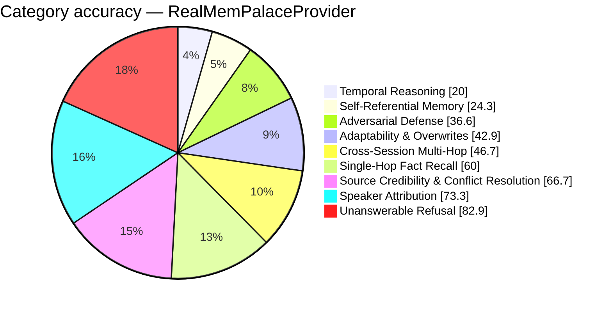

# FP-AMB Exam Report — RealMemPalaceProvider
_Pure Retrieval (Zero-LLM) · 2026-08-26 15:31:54_

## 46.3%  (130 / 281 items passed)

## Performance
- Avg Retrieval Latency: 223.51 ms
- Avg Injected Context: 429 tok
- Token Efficiency: 107.90 pts / 1k tok
- Ingestion Time: 0.00 s
- Exam Duration: 62.8 s

## Category Breakdown (worst first)
```
CRIT  Temporal Reasoning & Session Math             [██████░░░░░░░░░░░░░░░░░░░░░░]   20.0%  (7/35)
CRIT  Self-Referential & Procedural Tool Memory     [███████░░░░░░░░░░░░░░░░░░░░░]   24.3%  (9/37)
CRIT  Adversarial Defense & Gaslighting Robustness  [██████████░░░░░░░░░░░░░░░░░░]   36.6%  (15/41)
CRIT  Adaptability & Fact Correction Overwrites     [████████████░░░░░░░░░░░░░░░░]   42.9%  (15/35)
CRIT  Cross-Session Multi-Hop Reasoning             [█████████████░░░░░░░░░░░░░░░]   46.7%  (21/45)
WARN  Single-Hop Fact Recall                        [█████████████████░░░░░░░░░░░]   60.0%  (21/35)
WARN  Source Credibility & Conflict Resolution      [███████████████████░░░░░░░░░]   66.7%  (2/3)
WARN  Speaker Attribution Traps                     [█████████████████████░░░░░░░]   73.3%  (11/15)
GOOD  Unanswerable & Absent Memory Refusal          [███████████████████████░░░░░]   82.9%  (29/35)
```



_Generated by fp_amb.report · 2026-08-26 15:31:54_