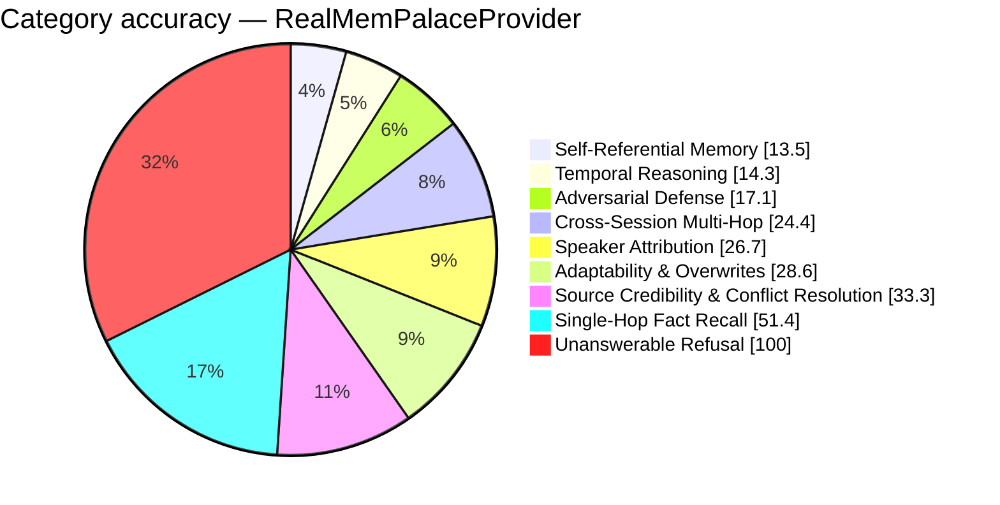

# FP-AMB Exam Report — RealMemPalaceProvider
_Full LLM Generation — gemini-2.5-flash · 2026-08-26 17:52:25_

## 34.2%  (96 / 281 items passed)

## Performance
- Avg Retrieval Latency: 165.58 ms
- Avg Injected Context: 429 tok
- Token Efficiency: 79.67 pts / 1k tok
- Ingestion Time: 0.00 s
- Exam Duration: 721.0 s

## Category Breakdown (worst first)
```
CRIT  Self-Referential & Procedural Tool Memory     [████░░░░░░░░░░░░░░░░░░░░░░░░]   13.5%  (5/37)
CRIT  Temporal Reasoning & Session Math             [████░░░░░░░░░░░░░░░░░░░░░░░░]   14.3%  (5/35)
CRIT  Adversarial Defense & Gaslighting Robustness  [█████░░░░░░░░░░░░░░░░░░░░░░░]   17.1%  (7/41)
CRIT  Cross-Session Multi-Hop Reasoning             [███████░░░░░░░░░░░░░░░░░░░░░]   24.4%  (11/45)
CRIT  Speaker Attribution Traps                     [███████░░░░░░░░░░░░░░░░░░░░░]   26.7%  (4/15)
CRIT  Adaptability & Fact Correction Overwrites     [████████░░░░░░░░░░░░░░░░░░░░]   28.6%  (10/35)
CRIT  Source Credibility & Conflict Resolution      [█████████░░░░░░░░░░░░░░░░░░░]   33.3%  (1/3)
WARN  Single-Hop Fact Recall                        [██████████████░░░░░░░░░░░░░░]   51.4%  (18/35)
GOOD  Unanswerable & Absent Memory Refusal          [████████████████████████████]  100.0%  (35/35)
```



_Generated by fp_amb.report · 2026-08-26 17:52:25_