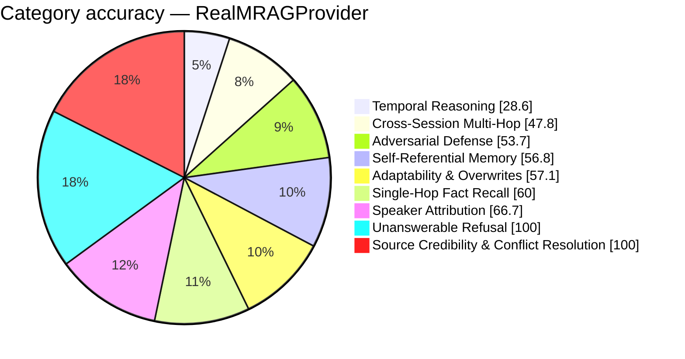

# FP-AMB Exam Report — RealMRAGProvider
_Full LLM Generation — gemini-2.5-flash · 2026-08-26 18:22:03_

## 58.2%  (163.5 / 281 items passed)

## Performance
- Avg Retrieval Latency: 2730.77 ms
- Avg Injected Context: 697 tok
- Token Efficiency: 83.23 pts / 1k tok
- Ingestion Time: 303.45 s
- Exam Duration: 1473.9 s

## Category Breakdown (worst first)
```
CRIT  Temporal Reasoning & Session Math             [████████░░░░░░░░░░░░░░░░░░░░]   28.6%  (10/35)
CRIT  Cross-Session Multi-Hop Reasoning             [█████████████░░░░░░░░░░░░░░░]   47.8%  (21.5/45)
WARN  Adversarial Defense & Gaslighting Robustness  [███████████████░░░░░░░░░░░░░]   53.7%  (22/41)
WARN  Self-Referential & Procedural Tool Memory     [████████████████░░░░░░░░░░░░]   56.8%  (21/37)
WARN  Adaptability & Fact Correction Overwrites     [████████████████░░░░░░░░░░░░]   57.1%  (20/35)
WARN  Single-Hop Fact Recall                        [█████████████████░░░░░░░░░░░]   60.0%  (21/35)
WARN  Speaker Attribution Traps                     [███████████████████░░░░░░░░░]   66.7%  (10/15)
GOOD  Unanswerable & Absent Memory Refusal          [████████████████████████████]  100.0%  (35/35)
GOOD  Source Credibility & Conflict Resolution      [████████████████████████████]  100.0%  (3/3)
```



_Generated by fp_amb.report · 2026-08-26 18:22:03_