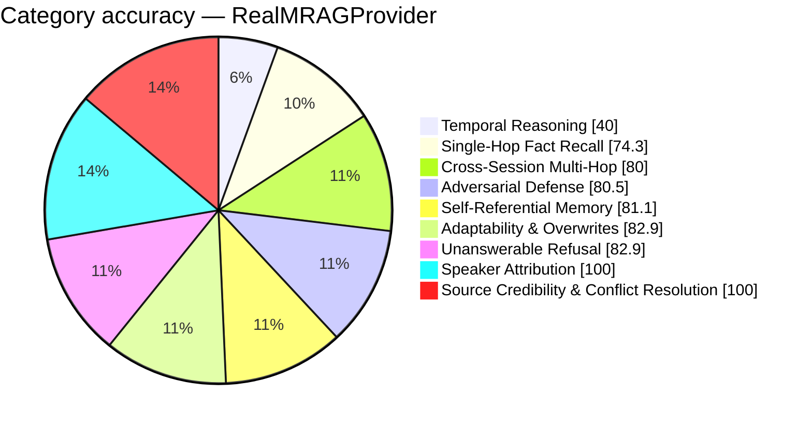

# FP-AMB Exam Report — RealMRAGProvider
_Pure Retrieval (Zero-LLM) · 2026-08-26 15:41:19_

## 76.5%  (215 / 281 items passed)

## Performance
- Avg Retrieval Latency: 2988.11 ms
- Avg Injected Context: 697 tok
- Token Efficiency: 109.81 pts / 1k tok
- Ingestion Time: 308.18 s
- Exam Duration: 839.7 s

## Category Breakdown (worst first)
```
CRIT  Temporal Reasoning & Session Math             [███████████░░░░░░░░░░░░░░░░░]   40.0%  (14/35)
WARN  Single-Hop Fact Recall                        [█████████████████████░░░░░░░]   74.3%  (26/35)
GOOD  Cross-Session Multi-Hop Reasoning             [██████████████████████░░░░░░]   80.0%  (36/45)
GOOD  Adversarial Defense & Gaslighting Robustness  [███████████████████████░░░░░]   80.5%  (33/41)
GOOD  Self-Referential & Procedural Tool Memory     [███████████████████████░░░░░]   81.1%  (30/37)
GOOD  Adaptability & Fact Correction Overwrites     [███████████████████████░░░░░]   82.9%  (29/35)
GOOD  Unanswerable & Absent Memory Refusal          [███████████████████████░░░░░]   82.9%  (29/35)
GOOD  Speaker Attribution Traps                     [████████████████████████████]  100.0%  (15/15)
GOOD  Source Credibility & Conflict Resolution      [████████████████████████████]  100.0%  (3/3)
```



_Generated by fp_amb.report · 2026-08-26 15:41:19_