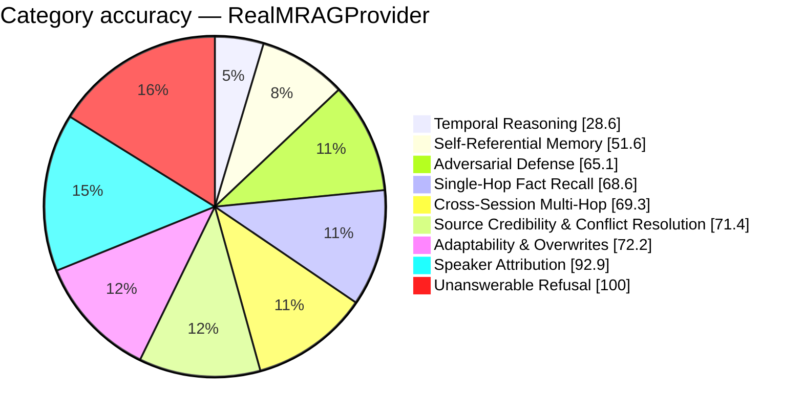

# FP-AMB Exam Report — RealMRAGProvider
_Full LLM Generation — gemini-2.5-flash · 2026-08-27 19:23:49_

## 66.6%  (174.5 / 262 items passed)

## Performance
- Avg Retrieval Latency: 4533.96 ms
- Avg Injected Context: 710 tok
- Token Efficiency: 93.85 pts / 1k tok
- Ingestion Time: 291.02 s
- Exam Duration: 1809.8 s

## Category Breakdown (worst first)
```
CRIT  Temporal Reasoning & Session Math             [████████░░░░░░░░░░░░░░░░░░░░]   28.6%  (10/35)
WARN  Self-Referential & Procedural Tool Memory     [██████████████░░░░░░░░░░░░░░]   51.6%  (16/31)
WARN  Adversarial Defense & Gaslighting Robustness  [██████████████████░░░░░░░░░░]   65.1%  (28/43)
WARN  Single-Hop Fact Recall                        [███████████████████░░░░░░░░░]   68.6%  (24/35)
WARN  Cross-Session Multi-Hop Reasoning             [███████████████████░░░░░░░░░]   69.3%  (30.5/44)
WARN  Source Credibility & Conflict Resolution      [████████████████████░░░░░░░░]   71.4%  (5/7)
WARN  Adaptability & Fact Correction Overwrites     [████████████████████░░░░░░░░]   72.2%  (13/18)
GOOD  Speaker Attribution Traps                     [██████████████████████████░░]   92.9%  (13/14)
GOOD  Unanswerable & Absent Memory Refusal          [████████████████████████████]  100.0%  (35/35)
```



_Generated by fp_amb.report · 2026-08-27 19:23:49_