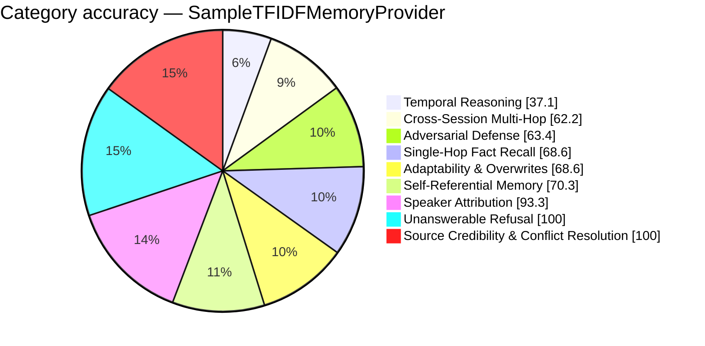

# FP-AMB Exam Report — SampleTFIDFMemoryProvider
_Full LLM Generation — gemini-2.5-flash · 2026-08-26 18:32:10_

## 68.7%  (193 / 281 items passed)

## Performance
- Avg Retrieval Latency: 2.47 ms
- Avg Injected Context: 838 tok
- Token Efficiency: 81.98 pts / 1k tok
- Ingestion Time: 0.00 s
- Exam Duration: 606.3 s

## Category Breakdown (worst first)
```
CRIT  Temporal Reasoning & Session Math             [██████████░░░░░░░░░░░░░░░░░░]   37.1%  (13/35)
WARN  Cross-Session Multi-Hop Reasoning             [█████████████████░░░░░░░░░░░]   62.2%  (28/45)
WARN  Adversarial Defense & Gaslighting Robustness  [██████████████████░░░░░░░░░░]   63.4%  (26/41)
WARN  Single-Hop Fact Recall                        [███████████████████░░░░░░░░░]   68.6%  (24/35)
WARN  Adaptability & Fact Correction Overwrites     [███████████████████░░░░░░░░░]   68.6%  (24/35)
WARN  Self-Referential & Procedural Tool Memory     [████████████████████░░░░░░░░]   70.3%  (26/37)
GOOD  Speaker Attribution Traps                     [██████████████████████████░░]   93.3%  (14/15)
GOOD  Unanswerable & Absent Memory Refusal          [████████████████████████████]  100.0%  (35/35)
GOOD  Source Credibility & Conflict Resolution      [████████████████████████████]  100.0%  (3/3)
```



_Generated by fp_amb.report · 2026-08-26 18:32:10_