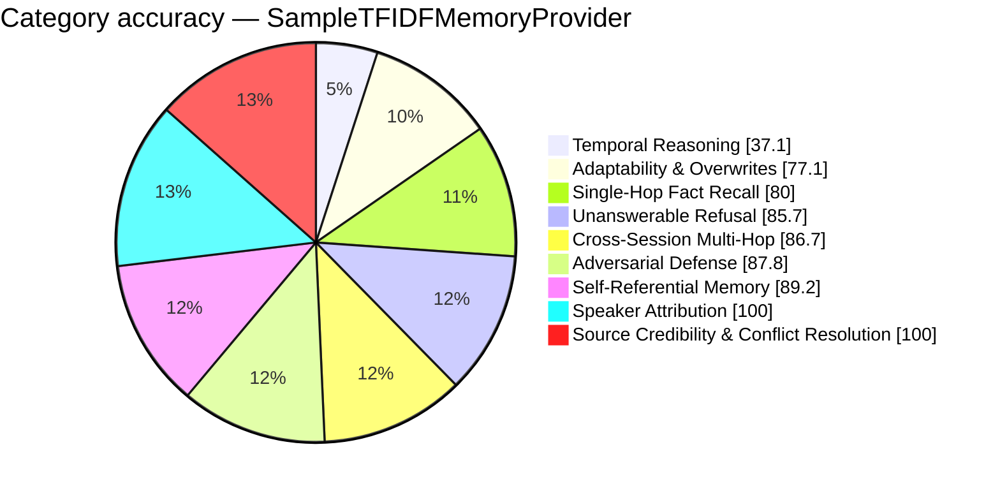

# FP-AMB Exam Report — SampleTFIDFMemoryProvider
_Pure Retrieval (Zero-LLM) · 2026-08-26 14:25:30_

## 79.7%  (224 / 281 items passed)

## Performance
- Avg Retrieval Latency: 1.34 ms
- Avg Injected Context: 838 tok
- Token Efficiency: 95.15 pts / 1k tok
- Ingestion Time: 0.00 s
- Exam Duration: 0.4 s

## Category Breakdown (worst first)
```
CRIT  Temporal Reasoning & Session Math             [██████████░░░░░░░░░░░░░░░░░░]   37.1%  (13/35)
WARN  Adaptability & Fact Correction Overwrites     [██████████████████████░░░░░░]   77.1%  (27/35)
GOOD  Single-Hop Fact Recall                        [██████████████████████░░░░░░]   80.0%  (28/35)
GOOD  Unanswerable & Absent Memory Refusal          [████████████████████████░░░░]   85.7%  (30/35)
GOOD  Cross-Session Multi-Hop Reasoning             [████████████████████████░░░░]   86.7%  (39/45)
GOOD  Adversarial Defense & Gaslighting Robustness  [█████████████████████████░░░]   87.8%  (36/41)
GOOD  Self-Referential & Procedural Tool Memory     [█████████████████████████░░░]   89.2%  (33/37)
GOOD  Speaker Attribution Traps                     [████████████████████████████]  100.0%  (15/15)
GOOD  Source Credibility & Conflict Resolution      [████████████████████████████]  100.0%  (3/3)
```



_Generated by fp_amb.report · 2026-08-26 14:25:30_