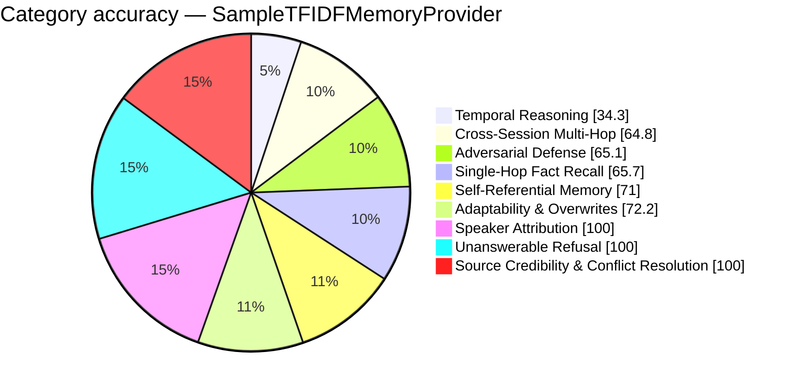

# FP-AMB Exam Report — SampleTFIDFMemoryProvider
_Full LLM Generation — gemini-2.5-flash · 2026-08-27 19:33:31_

## 69.7%  (182.5 / 262 items passed)

## Performance
- Avg Retrieval Latency: 3.11 ms
- Avg Injected Context: 820 tok
- Token Efficiency: 84.95 pts / 1k tok
- Ingestion Time: 0.00 s
- Exam Duration: 580.4 s

## Category Breakdown (worst first)
```
CRIT  Temporal Reasoning & Session Math             [██████████░░░░░░░░░░░░░░░░░░]   34.3%  (12/35)
WARN  Cross-Session Multi-Hop Reasoning             [██████████████████░░░░░░░░░░]   64.8%  (28.5/44)
WARN  Adversarial Defense & Gaslighting Robustness  [██████████████████░░░░░░░░░░]   65.1%  (28/43)
WARN  Single-Hop Fact Recall                        [██████████████████░░░░░░░░░░]   65.7%  (23/35)
WARN  Self-Referential & Procedural Tool Memory     [████████████████████░░░░░░░░]   71.0%  (22/31)
WARN  Adaptability & Fact Correction Overwrites     [████████████████████░░░░░░░░]   72.2%  (13/18)
GOOD  Speaker Attribution Traps                     [████████████████████████████]  100.0%  (14/14)
GOOD  Unanswerable & Absent Memory Refusal          [████████████████████████████]  100.0%  (35/35)
GOOD  Source Credibility & Conflict Resolution      [████████████████████████████]  100.0%  (7/7)
```



_Generated by fp_amb.report · 2026-08-27 19:33:31_